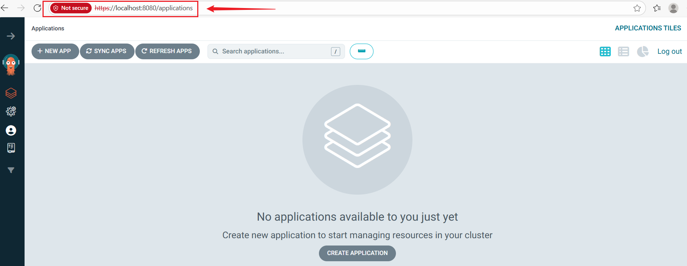
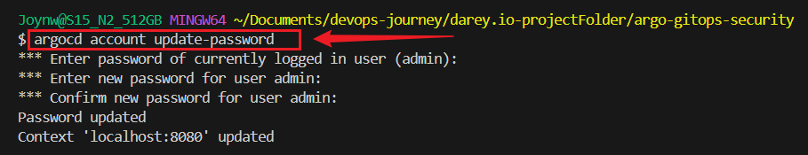

# GitOps Security & Access Control in ArgoCD


## Project Overview

This project demonstrates how to secure an ArgoCD GitOps environment using:

- **Role-Based Access Control (RBAC)** for Admin / Developer / Viewer
- **OAuth / Single Sign-On (SSO)** via Google (OIDC example)
- **Audit Trails & Compliance Strategies**

--- 


## Project Objectives

1. Install ArgoCD in a Kubernetes cluster.
2. Implement Role-Based Access Control (RBAC) for three roles:
   - **Admin Role**: Full control of ArgoCD.
   - **Developer Role**: Can manage & sync applications in `my-project`.
   - **Viewer Role**: Read-only access to `my-project`.
3. Secure ArgoCD with OAuth / Single Sign-On (SSO).
4. Enable audit logs and compliance strategies to track changes in ArgoCD.

---


## Prerequisites

- Kubernetes cluster (minikube, k3s, Kind, or cloud provider)

- kubectl installed

- argocd CLI installed

- **Google Cloud Project** with OAuth consent screen configured

- **Google OAuth Client ID + Secret** (for SSO)
---


## Project Structure
```
argo-gitops-security/
├── README.md
├── .gitignore
├── k8s/       
│   ├── argocd-rbac-cm.yaml             
│   ├── argocd-cm.yaml                  
│   ├── argocd-secret.yaml              
│   └──argocd-oauth.yaml                   
├── audit/
│   └── audit-policy.yaml               
```

---


## Project Setup

### 1. Install ArgoCD

```bash
minikube start
kubectl create namespace argocd
kubectl apply -n argocd -f https://raw.githubusercontent.com/argoproj/argo-cd/stable/manifests/install.yaml
```

### Keep port-forward running 
```bash
kubectl port-forward svc/argocd-server -n argocd 8080:443
```
Visit ArgoCD UI at: `https://localhost:8080`

---

### 2. Get initial admin password:
```bash
kubectl -n argocd get secret argocd-initial-admin-secret -o jsonpath="{.data.password}" | base64 --decode && echo
```


Login with:

  - Username: admin

  - Password: <from above>


### Update password:

### Change the password
```bash
argocd login localhost:8080 --username admin --password <old-pass> --insecure
argocd account update-password
```

                   
---


## 3. Configure RBAC:

Example role binding **(k8s/argocd-rbac.yaml):**
```bash
apiVersion: rbac.authorization.k8s.io/v1
kind: RoleBinding
metadata:
  name: argocd-cluster-admin
  namespace: argocd
subjects:
- kind: ServiceAccount
  name: argocd-server
roleRef:
  kind: ClusterRole
  name: cluster-admin
  apiGroup: rbac.authorization.k8s.io
```

#### Apply:
```bash
kubectl apply -f k8s/argocd-rbac.yaml
```

---

## 4. Configure Google OAuth SSO

### Step 1: Set up Consent Screen

- Go to Google Cloud Console → APIs & Services → OAuth consent screen

- Choose External

- Fill App name, Support email, and Developer contact info

- Add your Gmail as a Test User

- Save

### Step 2: Create OAuth Client

- Go to APIs & Services → Credentials → Create Credentials → OAuth Client ID

- Application type: Web Application

- Authorized redirect URI:

```bash
https://localhost:8080/api/dex/callback
```
Copy **Client ID** and **Client Secret**


## Step 3: Configure ArgoCD
### Create k8s/argocd-cm.yaml
```bash
apiVersion: v1
kind: ConfigMap
metadata:
  name: argocd-cm
  namespace: argocd
data:
  url: https://localhost:8080
  dex.config: |
    connectors:
    - type: oidc
      id: google
      name: Google
      config:
        issuer: https://accounts.google.com
        clientID: <YOUR_GOOGLE_CLIENT_ID>
        clientSecret: $argocd-secret:clientSecret
        redirectURI: https://localhost:8080/api/dex/callback
```


## Create k8s/argocd-secret.yaml file
```bash
apiVersion: v1
kind: Secret
metadata:
  name: argocd-secret
  namespace: argocd
type: Opaque
stringData:
  clientSecret: <YOUR_GOOGLE_CLIENT_SECRET>
```


## Step 5: Apply configs
```bash
kubectl apply -f k8s/argocd-secret.yaml
kubectl apply -f k8s/argocd-cm.yaml
kubectl rollout restart deployment argocd-server -n argocd
```


## Step 6: Verify

#### Keep port-forwarding:
```bash
kubectl port-forward svc/argocd-server -n argocd 8080:443
```

- Visit: `https://localhost:8080`

- You should now see “Login with Google”.

- Sign in with the Gmail you added as a test user.

### Apply and restart:

```bash
kubectl apply -f k8s/argocd-secret.yaml
kubectl apply -f k8s/argocd-cm.yaml
kubectl rollout restart deployment/argocd-server -n argocd
```

### Step 4: Verify
- Port-forward again:

```bash
kubectl port-forward svc/argocd-server -n argocd 8080:443
```
- Open `https://localhost:8080/example/callback`
- You should now see “Login with Google” 


## 5. Audit Logs

- Enable audit logging in argocd config:
```bash
server:
  config:
    logFormat: "text"
```


## 6. Connect your local project to GitHub

###  Initialize $ Push to Git 
```bash
git init
git add .
git commit -m "Initial commit - project setup for ArgoCD GitOps Security"
git remote add origin https://github.com/<your-username>/argo-gitops-security.git
git branch -M main
git push -u origin main
```